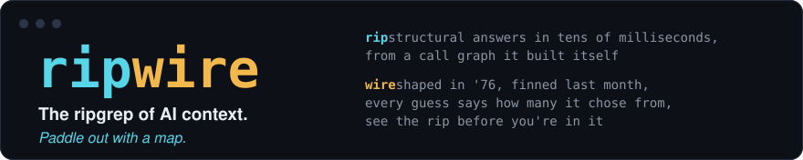

<p align="center"></p>

[](https://github.com/redhat-et/ripwire/actions/workflows/ci.yml)
[](https://github.com/redhat-et/ripwire/releases/latest)
[](LICENSE)
[](CONTRIBUTING.md)
[](THIRD_PARTY.md)

# ripwire

## Give your coding agent a map before it reads the repo.

**ripwire is the ripgrep of AI context.** Point it at a repository and your coding agent gets a
ranked, deterministic call graph instead of grepping around and reading whole files — orientation,
blast radius, and which tests to run.

- **Saves tokens** — on a fresh thread in an unfamiliar codebase, the agent answers at **7.3%** of
  what a grep-and-read pass costs; head-to-head, all gold files landed in the top 10 on **58.3%**
  of instances against **33.3%** for the best competitor tested.
- **Goes faster** — a 1,560-file repository parses in **~1 s** cold; every warm query after that
  answers in **~0.1 s**.
- **Writes better code** — the quality verbs measure what a change made *worse*
  (`--quality-delta`), surface the repo's best-in-class pattern to imitate (`--exemplar`), and
  name the tests that must run before "done" (`--test-gate`).

Zero runtime dependencies, C++23, builds with the network off. Those numbers have different
instruments and important caveats — the losses ship beside the wins in [Measured](#measured) and
[`docs/EVALS.md`](docs/EVALS.md).

Built for **Codex, Claude Code, Cursor, Windsurf, Gemini, aider**, and any agent that can call a CLI.

```bash
ripwire . --for="incremental cache invalidation"
```

One deterministic, token-budgeted answer: the relevant symbols, their callers, the change risks,
and the tests that reach them.

<details>
<summary><b>What comes back</b> — real output from this repository, pretty-printed and trimmed</summary>

```xml
<ctx task="incremental cache invalidation" est_tokens="2934">
  <f p="./src/quality.h">
    <d l="440" n="cacheDirLadder"       cx="16" ccx="14" in="11" churn="10" amp="49" tested="1">inline std::string cacheDirLadder()</d>
    <d l="810" n="resolveCacheBlobPath" cx="4"  ccx="3"  in="4"  churn="10" amp="42">inline std::string resolveCacheBlobPath( const std::string&amp; dir, const std::string&amp; filename )</d>
    <d l="835" n="shaKeyedCachePath"    cx="1"  ccx="0"  in="6"  churn="10" amp="44">inline std::string shaKeyedCachePath( const char* family, const std::string&amp; repoHex, … )</d>
    <d l="844" n="headSnapCachePath"    cx="1"  ccx="0"  in="2"  churn="10" amp="40">inline std::string headSnapCachePath( const std::string&amp; repoHex, const std::string&amp; exclHex, … )</d>
  </f>
  <f p="./src/ingest.h">
    <d l="90" n="ingest" churn="4" amp="4"><doc>for vendored/generated trees not caught by the built-in dir denylist (--exclude=SUBSTR). cacheFi…</doc>IngestResult ingest( const char* rootDir, … )</d>
  </f>
  …
</ctx>
```

The cache-path cluster, ranked and annotated in place: `cx`/`ccx` complexity, `in` reuse count,
`churn` recent commits, `amp` change amplification, `tested` coverage — the fragile spots are
visible *before* the agent touches them, in a few thousand tokens instead of five whole files.

</details>

**Name a symbol and it's the first hit.** A confidence-gated router detects when the query *names*
something and switches rankers: recall@1 on name-shaped queries jumps **76.7% → 98.7%** in `src/`
(MRR 0.859 → 0.993) and **63.3% → 87.3%** at the repository root. The gate is the load-bearing
part — ungated, doc-phrase queries collapse from 0.993 to 0.427: an ungated router routes the
wrong queries, so both numbers are published together. Reproduce with `ripwire <dir>
--eval-retrieval`; full tables in [`bench/ANSWERQUALITY.md`](bench/ANSWERQUALITY.md) and
[Measured](#measured).

[Quickstart](#quickstart) · [Benchmarks](#measured) · [What it answers](#what-it-answers) ·
[Honesty contract](#the-honesty-contract) · [Agent setup](#set-it-up-in-your-coding-agent) ·
[Docs](#documentation) · [Slides](present/ripwire-showcase.pdf)

---

## Quickstart

**Prebuilt binary** — macOS (arm64 / x86-64) and Linux (arm64 / x86-64, built for **RHEL 8+**;
every release is smoke-tested on a RHEL 9 userland before it publishes). Downloads the latest
[GitHub Release](https://github.com/redhat-et/ripwire/releases), verifies its SHA-256, and installs
to `~/.local/bin`:

```bash
RIPWIRE_REPO=redhat-et/ripwire bash -c "$(curl -fsSL https://raw.githubusercontent.com/redhat-et/ripwire/main/scripts/install.sh)"
```

**Or build from source.** Requirements: CMake 3.24+ and a C++23 compiler. Nothing else —
tree-sitter's core, all 15 grammars and the test framework are vendored under `third_party/deps`,
so there is no download step and no package manager to satisfy. Prove that with the network off:
add `-DFETCHCONTENT_FULLY_DISCONNECTED=ON` and the build still completes.

Parses **C/C++, Objective-C/C++, Python, TypeScript, JavaScript, Java, Ruby, Bash, Go, Rust,
Swift, C#** — plus JSON config keys, Metal, and CUDA (`<<<>>>` launches are call edges).

```bash
git clone https://github.com/redhat-et/ripwire.git
cd ripwire
cmake -S . -B build && cmake --build build -j
./build/ripwire .          # the ranked map — start here on an unfamiliar repo
```

To put it on `PATH`, `./install.sh` builds and installs into a detected prefix (Homebrew's if
present, `~/.local` otherwise; override with `RIPWIRE_INSTALL_PREFIX`).

Wiring it into your agent takes one more minute — `wrap` **prints** the recipe for your client, it
never edits your config:

```bash
ripwire wrap claude             # prints: claude mcp add ripwire -- ripwire --mcp
ripwire wrap --all              # detect every installed agent, print each one's recipe
skills/install.sh --codex       # Codex CLI: the task-shaped skills that say when to query — and when to stop
```

The CLI is the recommended baseline because it works in every shell-capable agent; the MCP server is
optional, for agents whose workflow benefits from persistent tool registration. Full walkthrough,
all six clients: [Agent setup](#set-it-up-in-your-coding-agent).

Four commands worth learning first:

```bash
ripwire .                                          # the ranked map — start here
ripwire . --for="incremental cache invalidation"   # the task lens: what to touch, ranked
ripwire . --callers=someFunction                   # who calls it
ripwire . --test-gate                              # before you commit: which tests must run
```

> **Do not** configure a local tree with `-DCMAKE_BUILD_TYPE=Release`. Release defines `NDEBUG`,
> which compiles the degrade-path alerts out and blinds the gates that assert them. CI builds both
> flavours on purpose — see [`CONTRIBUTING.md`](CONTRIBUTING.md).

**The honesty contract, in one line:** every count ripwire cannot prove is a total ships labelled a
floor, every truncation is disclosed where it happens, and a zero means *none found* — never *none
exists*. Two runs over the same tree are byte-identical, and a warm run equals a cold one. That is a
contract, gated on every pull request and every push to main, not a tendency.
[The full discipline — and the losses published next to the wins →](#the-honesty-contract)

<!-- The name is the design: rip-grep for the retrieval half — a zero-runtime-dependency C++23
     binary that crawls a tree, extracts symbols with tree-sitter, resolves references into a call
     graph, ranks it with Personalized PageRank, and streams a deterministic minified XML map to
     stdout — and trip-wire for the honesty half. -->

---

## What it answers

Around the core sit 127 long flags advertised in `--help`, across seven families — plus an MCP
server, so a coding agent can call any of them mid-task instead of grepping and reading whole files.
`./build/ripwire --help` is generated from the binary's own flag table and is always the authority;
[`docs/COMMANDS.md`](docs/COMMANDS.md) documents 101 of the flags with a real invocation and its
recorded output. Each family below links there.

| Family | The question | Representative flags |
| --- | --- | --- |
| [**understand a codebase cold**](docs/COMMANDS.md#understand-a-codebase-cold) | "What is this repo, and what matters in it?" | `--for` · `--tree` · `--lego` · `--exemplar` · `--recall` · `--top-k` · `--token-budget` · `--max-tokens` |
| [**navigate / answer a question**](docs/COMMANDS.md#navigate--answer-a-question) | "Who calls this? Is it safe to change? Which tests?" | `--callers` · `--callees` · `--uses` · `--impact` · `--path` · `--connect` · `--affected` · `--situ` · `--test-gate` · `--grep` |
| [**zoom the detail ladder**](docs/COMMANDS.md#zoom-the-detail-ladder) | "Show me more — but only where it pays." | `--detail` · `--pack-signatures` · `--outline` · `--expand` · `--compress` |
| [**assess quality / structure**](docs/COMMANDS.md#assess-quality--structure) | "Where is the risk, and did I just add some?" | `--hotspots` · `--clones` · `--metrics` · `--deps` · `--lint` · `--quality-delta` · `--edit-check` · `--pr-context` · `--merge-scout` |
| [**self-diagnosis**](docs/COMMANDS.md#self-diagnosis) | "Is my setup actually working?" | `--doctor` |
| [**security**](docs/COMMANDS.md#--scan-skillsdir) | "Is this agent skill file safe to install?" | `--scan-skill` · `--scan-skills` |
| [**knobs / modes**](docs/COMMANDS.md#knobs--modes) | shape, format, cache, budget | `--json` · `--format` · `--mcp` |

Four reflexes worth wiring into muscle memory: `--from-trace=FILE` for an error you have in hand,
`--edit-check=SYM` right after an edit (did the contract change, and which callers are now provably
incompatible), `--merge-scout=REF1,REF2` before landing parallel branches, and `--pack-task="…"` for
ranking, bodies, callers and tests in one budgeted bundle.

---

## Real runs

Output is minified — one line, no whitespace between tags — so the excerpts below are wrapped for
reading, and each one's leading legend comment is elided. Nothing else is edited, except that
corpus-size numbers (file/symbol/edge counts, the ranked-map header's token/ambiguity tallies,
PageRank `k=` values, and the test-gate example's
`script_gates_unmodelled=` — a count of the script runners under `test/`, recursively) drift as this repository
grows: **the ranked map** elides those specifically, and says so again at the point of use, and **the
test gate** additionally trims its `<u>` rows down to 2 of the 25 the real run prints, behind a
trailing `…`.

**Ten seconds, no index server, no embeddings, no API key** — a parse and a call graph, built on the
spot:

```
$ ripwire . --callers=rankGraphTeleport
<callers of="rankGraphTeleport" defs="1" count="6" counts_floor="1">
<s t="fn" n="runEval" p="./src/eval.h:168"/>
<s t="fn" n="rankGraph" p="./src/graph.h:1768"/>
<s t="fn" n="anchoredLexicalRank" p="./src/graph.h:2104"/>
<s t="fn" n="churnRankedGraph" p="./src/main.cpp:9044"/>
<s t="fn" n="runDefaultMap" p="./src/main.cpp:9080"/>
<s t="fn" n="getIndex" p="./src/mcpindex.h:913"/>
</callers>
```

`counts_floor="1"` is the point. Call edges are extracted from source text by name, so dynamic
dispatch, callbacks and macro-generated call sites contribute no edge: `count="6"` is a **floor**,
and the element says so before you read a single row.

**The ranked map** — the default run, capped to three symbols so it fits here:

```
$ ripwire . --top-k=3
<!-- files=… symbols=… edges=… shown=3 est_tokens=… ambiguous=… unresolved=…
     precise=… skipped_oversize=… order=important-first -->
<r est_tokens="393">
<f p="./src/svector.h">
<s t="method" n="size" id="./src/svector.h::svector::size" k="…"></s>
<s t="method" n="push_back" id="./src/svector.h::svector::push_back" amb="2" k="…">
<c n="buf"/><c n="buf"/><c n="grow"/></s>
</f>
<f p="./src/scipoverlay.h">
<s t="method" n="empty" id="./src/scipoverlay.h::ScipOverlay::empty" k="…"></s>
</f>
</r>
```

`files=`/`symbols=`/`edges=` and the `k=` rank values are elided: this repository is the corpus here,
so they move every time README.md itself gains or loses a line, which is not what the example
demonstrates. The rest of the header measures the whole corpus, not the excerpt — the `ambiguous=` tally is
the call-graph completeness gauge, and `amb="2"` on a row says two of that symbol's calls hit a name
with several definitions and the resolver guessed. Read the source when which-target matters.

**The test gate** — `--test-gate` names the obligations and exits 4 while any remain. Captured with an
uncommitted change in the tree: `changed="1"` and the rows below appear only because something was
actually pending. A clean clone exits 0 with every changed/impacted/test count at zero — except
`script_gates_unmodelled=`, which is structural (it counts script-to-binary test runners the call
graph cannot see, not git status) and stays nonzero even then:

```
$ ripwire . --test-gate          # exit code: 4
<test-gate changed="1" impacted="80" tests="2" untested="76" shown_tests="2" tests_capped="0"
           shown_untested="25" untested_capped="1" script_gates_unmodelled="332" at="9cf0b16f3+dirty">
<t p="./test/adaptivecutshapefix/adaptive_cut_shape_test.cpp" run="bash test/adaptivecutshapecheck.sh"/>
<t p="./test/verify_radix.cpp"/>
<u sym="buildGraph" p="./src/graph.h" ccx="712"/>
<u sym="dispatchMcpLine" p="./src/mcp.h" ccx="428"/>
…
</test-gate>
```

A `run=` attribute appears only when a runner is derivable from real evidence — a test-dir script
whose stem matches the harness, or whose text names it. No `run=` means *not derivable*, never a
guessed suite command. `script_gates_unmodelled="332"` is the same discipline: script-to-binary is not
a call edge, so those gates are invisible to this walk, and the number says so rather than letting
`tests="2"` read as complete. The `<u>` rows are the untested blast radius: impacted symbols that no
test in the corpus reaches.

**From an error, not a paraphrase of one** — `--from-trace` takes a stack trace, sanitizer report or
compiler error on stdin or from a file, maps its frames onto indexed symbols innermost-first, and
returns the innermost in-corpus body with them:

```bash
./build/ripwire . --from-trace=asan_report.txt
cmake --build build 2>&1 | ./build/ripwire . --from-trace=-
```

---

## Measured

Every published number lives in **[`docs/EVALS.md`](docs/EVALS.md)** with the instrument that produced
it, the corpus it ran on, and the in-tree file that pins it — alongside a counterexample section and a
list of the claims this project deliberately does *not* publish. Read those first if you are here to
check whether the tool is oversold.

### Against other tools

**N = 60 paired instances, zero exclusions.** The first 60 scored held-out LocBench instances; same
gold set and the same metric code, imported unmodified, for every arm. *Strict file@10 = **all** gold
files inside the top 10.*

| Arm | strict file@10 | any@10 | median wall |
| --- | --- | --- | --- |
| **ripwire `--for`** | **36.7%** | 75.0% | **0.074 s** (warm, pre-built index) |
| codebase-memory-mcp | 26.7% | 66.7% | 1.14 s |
| graphify | 21.7% | 41.7% | 5.8 s |
| Aider repo-map | 13.3% | 33.3% | 2.5 s |

Paired win–loss at strict file@10: 16–2 against Aider, 10–4 against codebase-memory-mcp, 12–3 against
graphify. **The speed caveat travels with the number:** 2.5 s ÷ 0.074 s is ≈34× the Aider median, but
ripwire's figure is *warm with a pre-built index* while Aider's was *cold per run* — not an
apples-to-apples cache state. Quote the two medians, or quote the multiple with that sentence
attached.

**Round two (2026-08-03): repowise and codeseek.** Same slice, same gold definition, same imported
metric code — but a newer binary and evaluator, so the two rounds' tables are each internally
paired and **not number-comparable to each other** (provenance for both:
[`docs/EVALS.md` §2](docs/EVALS.md), full record with fairness notes in
[`bench/headtohead/r2-2026-08-03/`](bench/headtohead/r2-2026-08-03/)).

| Arm | strict file@10 | any@10 | median wall (query, warm) |
| --- | --- | --- | --- |
| **ripwire `--for`** | **58.3%** | **85.0%** | **0.114 s** |
| repowise 0.37.0 (MCP `search_codebase`, LLM-free wiki) | 33.3% | 53.3% | 1.14 s¹ |
| codeseek 0.1.31 (ident-mention convention arm) | 15.0% | 20.0% | 0.042 s |
| codeseek 0.1.31 (raw issue text, keyless fallback) | 0.0%² | 0.0% | 0.025 s |

Paired win–loss vs repowise at strict file@10: **17–2**; codeseek never beat ripwire on any instance.
The caveats travel with the table: ¹ repowise's wall includes a fresh MCP-server spawn per query —
resident-server usage is faster. ² codeseek's raw row returned **0 results on 60/60 queries** — its
keyless fallback matches function names only, so this measures a query-protocol boundary, not its
embedder-backed shipping mode (unbenchmarked here). On **untrimmed all-patch gold** — including files
ripwire cannot index — the ordering holds and the margin narrows: **28.3%** vs repowise's 16.7%.
**Vexp and CodeIndexer were excluded, not beaten**: their free tiers (node/project/chunk caps) cannot
run a fair 60-instance sweep; the report records the exact limits. An independent adversarial pass
attacked the comparison's design and its findings — and their dispositions — ship with the report
([`VERIFIER.md`](bench/headtohead/r2-2026-08-03/VERIFIER.md)).

**Round three (2026-08-03): headroom — the compression-layer competitor.** headroom
(`headroom-ai==0.33.0`, 64k★) compresses context an agent already fetched; it retrieves nothing —
so this round's instrument is **tokens-to-correct-answer** on 12 pre-registered mid-task questions
(django @ pinned commit, five arms, one tokenizer), not file@k. **ripwire won every measure the two
tools share.** headroom's default config passed every code chunk through **byte-identical** — its
own protective guards fired throughout, netting −410 tokens on a 685,682-token workload (its own
limitations page says "Code — Passthrough"; this run confirms it live) — and stacking it on
ripwire's output added **exactly 0 tokens** of savings: the map is already past the density
compression targets. ripwire answered at **7.3%** of the naive grep-and-read baseline's tokens
(**1.7%** on the subset both arms fully answered), warm in ~0.14 s per verb. **The losses in this
round are ripwire's own, and they are published first**: under the frozen no-human verb ladders it
strictly satisfied only **5/12** questions vs the naive baseline's 11/12 — four ranking defects,
one missing symbol kind, two harness artifacts, each bucketed with its fix disposition in the
report. What the round does **not** show: headroom's home turf (JSON/log tool-output compression,
provider-cache economics) was deliberately not measured — ripwire does not compete there.
Provenance: [`docs/EVALS.md` §2](docs/EVALS.md), full record + adversarial verification (which
materially corrected the draft's arithmetic in headroom's favor) in
[`bench/headtohead/r3-headroom-2026-08-03/`](bench/headtohead/r3-headroom-2026-08-03/).

**LocBench held-out, N = 243 across 78 repositories.** Strict file@10 **60.9%**, against **27.6%** for
the pre-routing baseline — a paired **+33.33pp** with a clustered-bootstrap 95% lower bound of
**+25.00pp**, bought for +3.4% warm latency and **−39.4%** on the production token ceiling. More
accurate *and* cheaper, which is why it shipped.

### What it saves you, in tokens

Context is the budget an agent actually spends. Three measurements, each with the instrument that
pins it:

| Where the saving comes from | Measured | Pinned by |
| --- | --- | --- |
| `--pack-signatures` — body-elided declaration skeletons instead of full bodies | **67.0% fewer element bytes** at top-50 (46.7% at top-10, 66.2% at top-100) | `test/showcasecapturecheck.sh`, re-derived from this repo every run |
| Query-shape routing, on the production token ceiling | **−39.4%** p50, while strict file@10 rose +33.33pp | `bench/locbench/`, [EVALS §3](docs/EVALS.md) |
| A whole-question bundle against a naive agent read | **96.0% fewer tokens (24.9×)** — 14,758 against 367,192, tiktoken `cl100k_base`, six realistic questions | `bench/BENCHMARK.md` — *historical, private corpus, not reproducible from this tree* |

Read the first row's methodology before quoting it: element bytes are counted **root-neutralised**,
with the corpus-root prefix subtracted from both sides, because the root repeats inside every element,
is charged in both forms, and is not what this verb elides. Quote the top-50 figure — the signature
payload is top-50 whatever `--top-k` says, and top-10 is a ten-symbol sample that one one-line
accessor can move several points. The gate fails if the documentation drifts more than 1.5 points from
the binary.

And the third row's caveat is not small: it was measured 2026-06-20 on a large private C++ corpus, it
is not publicly reproducible from this tree, and it proves *cheaper and faster*, not *better
outcomes*.

**The losses ship next to the wins.** `--grep` costs more tokens than it saves (**+19.7%** on one
measure, −11.2% on the other) — it is not a token reducer. `--pack-signatures` inverts on a short
symbol: 303 bytes of signature-plus-doc-comment against a 158-byte body. The headline is a property of
large result sets, and [the full counterexample list](#in-the-numbers) is part of the contract, not an
appendix.

---

### Where its own cycles go — hardware counters, per scope

The self-profiler (`-DRIPWIRE_PROFILE=ON`; `src/infra/profileScope.h` + `profilePmc.h`) brackets every
pipeline phase with two hardware-counter reads — kperf on Apple Silicon, a pinned `perf_event_open`
group on Linux. Below: ripwire mapping **its own public tree** on an Apple M5 Pro, cold
(`--no-cache`) except the last row. Counters are raw integers, never scaled; reproduce steps in
[`bench/PROFILE.md`](bench/PROFILE.md) (arming needs root; unprivileged runs print the same table
with timing columns only — the honest degrade).

| scope | calls | instructions | IPC | L1D MPKI | wall |
| --- | --- | --- | --- | --- | --- |
| tree-sitter parse | 803 | 8.74 B | 3.52 | 4.0 | 731 ms |
| tags query exec + captures | 803 | 8.65 B | 3.22 | 3.0 | 635 ms |
| resolve refs + build CSR | 1 | 54.6 M | 3.27 | 35.4 | 3.6 ms |
| PageRank (power iteration) | 1 | 13.7 M | 3.17 | 32.4 | 0.93 ms |
| serialize ranked map | 1 | 3.24 M | 2.43 | 6.1 | 0.29 ms |
| **warm run** — loadCache (read + deserialize) | 1 | 52.3 M | 3.18 | 7.5 | 3.6 ms |

Three things the counters say that wall-clock alone cannot. The parse/query phases are
compute-dense, not stall-bound: 3.2–3.5 instructions retired per cycle at ~3–4 L1D misses per
thousand. The graph phases stream hard — 32–35 L1D MPKI — yet hold IPC above 3.1, which is the
DOD/SoA/CSR layout (G2) doing its visible job. And the auto-cache's whole story in two rows: a warm
run replaces the dominant phase's 8.74 B instructions with a 52.3 M-instruction cache load, ≈167×
fewer instructions. Caveats travel with the table: counters are per-thread and aggregated per
scope, so rows must not be summed across scopes (a recursive site samples only its outermost
frame); one machine, one corpus — re-run on yours. Backend contract is gated by
[`test/pmccheck.sh`](test/pmccheck.sh); M5 Pro event names verified (the last-level alias resolves
via `PL2_CACHE_MISS_LD`).

**Every number on this page is the DEFAULT build — and there is a faster one you can opt into.** A
clang optimization-remarks pass over `src/` (`-DRIPWIRE_OPT_REMARKS=ON`; the whole triage is in
[`docs/OPTREMARKS.md`](docs/OPTREMARKS.md)) found that the phases above spend their time calling
tree-sitter's C API across a translation-unit boundary — 397 of 636 distinct `inline/NoDefinition`
remarks in the hot TU name a `ts_*` accessor. Two build options answer that, both **off by default**:

| build | cold | warm | |
| --- | --- | --- | --- |
| `-DRIPWIRE_LTO=OFF` | baseline | baseline | the fast edit loop, not the fast binary |
| **default** (`cmake -S . -B build`, LTO on) | 1–6% faster | 0–3% faster | |
| `scripts/pgobuild.sh` (PGO on top of LTO) | **14–25% faster** (6–16% over the default) | 5–10% faster | the fastest binary this tree can produce |

Measured by interleaved A/B (`A,B,A,B,…`, median **and** min, 9–31 runs per arm, repeated) on this
repository *and* on a ~2000-file C++ tree that appears in no training run — the held-out corpus shows
the same or larger gain, which is what rules out training on the benchmark. **Output is
byte-identical** on all three builds and on both corpora, and the determinism gate passes on every
tree; these options change how fast the answer arrives, never what it is. Cold gains 2–3× more than
warm because cold is a branchy walk over tree-sitter's parse tree, while warm already runs in the
cache-tuned CSR/SoA/B+tree structures G2 exists to produce. **LTO is on by default** — it costs link
time and nothing else, and link time is not what this tool is optimized for. PGO needs a training
run, so it stays a driven build (`scripts/pgobuild.sh`) rather than something a bare
`cmake --build` does behind your back.

**And on machines with no PMU at all — most cloud VMs and CI boxes — the counter columns no longer
vanish.** A kernel that refuses every hardware event (`ENOENT`; no vPMU is the common cloud case)
still offers software counters, so the Linux backend's per-event graceful skip now extends to the
group leader and falls through to two `PERF_TYPE_SOFTWARE` rows — `task-clock` (on-CPU ns) and
`page-faults` — under their own column names, never as a stand-in for the hardware counts. Below,
ripwire mapping its own tree, cold, on the 2-vCPU vPMU-less Intel Xeon VM this was validated live
on:

| scope | calls | wall | task-clock (on-CPU) | page-faults |
| --- | --- | --- | --- | --- |
| tree-sitter parse | 799 | 1,773 ms | 1,134 ms | 6.4 k |
| tags query exec + captures | 799 | 1,084 ms | 1,071 ms | 6.7 k |
| doc post-pass (main-thread wait on the pool) | 1 | 2,174 ms | 0.50 ms | 0 |
| resolve refs + build CSR | 1 | 12.32 ms | 12.31 ms | 7 |

Four things this buys that wall-clock alone cannot say. The wall−task-clock gap is *off-CPU time*:
the parse phase's 36% gap is 2-vCPU oversubscription made visible (a pool parsing 799 files on two
cores). The CSR row is a live cross-check: `task-clock` is the kernel's clock, the wall column is
the profiler's own — two independent clocks agreeing to 0.05% on a single-threaded scope. (Short
hot scopes diverge by the documented read-bracket overhead instead: the counter bracket encloses
the tick bracket.) The `page-faults` column is a **G2 witness**: PageRank's power iteration retires
with **zero** page faults and the CSR build with **7**, against ~3,100 in the allocation-heavy
model-build scopes — the no-allocation rule inside the ranked loop, watchable on a box with no PMU.
And the doc post-pass row caught something real: 2.17 s of wall on **0.5 ms** of CPU is work
happening *outside the process* — with `markitdown` installed, the showcase PDF and PPTX are
re-extracted by subprocess on **every** run, cache or no cache, which on this box is ~97% of a warm
run's wall (2.05 s of 2.11 s); child CPU is invisible to every per-thread counter, and the
wall-vs-task-clock gap is precisely the signature that flags it. (The extraction is already
documented in-tree as a pure function of the file bytes — a cache candidate, now measured.) Only a
kernel that offers nothing at all — `perf_event_paranoid>=3`, seccomp — still degrades to
timing-only, and `pmccheck`'s inactive arm now proves that was truly the case.

## Standing on the whole field

Almost none of the ideas here are new; the combination and the constraints are. Lessons folded from
**28 repositories and 30 papers** into one deterministic executable, alongside a labelled
survey of 220 tools that folded nothing and are catalogued separately — the two sets are disjoint,
so they add rather than nest. The row-by-row ledger, each with the lesson taken and where it lives, is
[`docs/LINEAGE.md`](docs/LINEAGE.md). Those three counts are derived from that document's own tables
by `test/readmedriftcheck.sh`, which fails if this sentence and those tables disagree.

---

## The honesty contract

The differentiator is not a number, it is a discipline: **a measurement you cannot check is a claim,
and this tool ships the check.**

### In the output

- **A zero is a measurement, not an absence.** `counts_floor="1"` marks every count that name-based
  resolution cannot prove is a total. Read a zero as *none found*, never *none exists*.
- **Truncation is disclosed where it happens.** `shown_*`, `*_capped=` and the paging attributes say
  what was withheld and how to page it; the legend comment that leads each document defines the
  vocabulary in full, so the output explains itself without this README.
- **Units are named, because they differ by verb.** The callers count is distinct symbols, the impact
  count is a reach set, the uses count is call sites. The legend says which, so two numbers that look
  contradictory can be read as the different questions they answer.

### In the numbers

The evaluation labels were authored by reading the source and deciding which symbol *is* the on-task
answer — never by transcribing the ranker's own output — so the eval is allowed to say the ranker is
wrong, and it has. These are the results that say so, all in-tree, all published on purpose:

- **`--grep` costs more tokens than it saves**, and **`--pack-signatures` can make output bigger** —
  both quantified [next to the savings they qualify](#what-it-saves-you-in-tokens), because saying so
  is cheaper than being caught.
- **The public C++ number is materially lower than the earlier private one.** SFML: strict file@10
  31.3%, any@10 45.2%, first-hit MRR 0.22 — against roughly 89% any@10 on a private corpus that is no
  longer reproducible from this tree. The public number is the baseline going forward.
- **PageRank is a bad co-change ranker** — 3.8% recall@5 against 40.3% for plain lexical, and fusing
  the two made it worse. Relatedness is lexical; importance is structural; the tool uses different
  machinery for each because the measurement said so.
- **Strict multi-file localization is hard and stays hard.** Held-out LocBench: single-file gold
  73.4%, multi-file 18.2%. Every corpus shows the same cliff.

### In the tests

`test/regression.sh` names **334 gate scripts** and is the authoritative list;
`python3 test/pargates.py . ./build/ripwire -j 6` runs the same set in parallel. On top of them sit the
contracts that do not fit a unit test: two runs byte-identical, warm output identical to cold, output
that pipes clean through `xmllint --noout`, a sanitizer build with `-fno-sanitize-recover=all`, and a
differential argv harness that runs a reference binary and the candidate over every argument vector
and requires stdout, stderr and exit code to match on each.

The house rule behind all of it: **write the gate before the code it measures.** A ranking, a token
estimate and a call graph all look plausible whether or not they are correct.

---

## Set it up in your coding agent

Two steps, both under a minute: register the MCP server so the agent can call ripwire mid-task, then
install the skills that tell it *when* to.

### 1. Register the server

`ripwire wrap <agent>` prints the recipe for the agent you name. It **prints**; it never edits your
config — you read the line, then run it.

```bash
ripwire wrap claude      # MCP:      claude mcp add ripwire -- ripwire --mcp
ripwire wrap cursor      # MCP:      the mcpServers stanza for .cursor/mcp.json (or ~/.cursor/mcp.json)
ripwire wrap codex       # MCP:      codex mcp add ripwire -- ripwire --mcp (+ TOML fallback)
ripwire wrap windsurf    # MCP:      that client's stanza
ripwire wrap gemini      # MCP:      that client's stanza
ripwire wrap aider       # no MCP:   a ranked map file, and the aider invocation that reads it
ripwire wrap --all       # detect every installed agent and emit each one's config
```

That registers one stdio server — `ripwire --mcp` — exposing **30 verbs**: 15 read verbs, 12
flagship-reflex verbs, and 3 span-addressed edit verbs. Read verbs mirror the CLI (`analyze`, `for`,
`grep`, `cochange`, `fetch_body`, `lego`, `mentions`, `owners`, `memory_recall`,
`situational_awareness`, `batch`, …); `find_symbol` and `find_referencing_symbols` attach a stable
`handle` instead of a body, so the agent fetches source only when it actually needs it. The edit verbs
enforce a safety contract — staleness refusal, ambiguity refusal, atomic writes. Full reference:
[`skills/ripwire-mcp/`](skills/ripwire-mcp/).

Before printing, `wrap` security-scans `./skills` and `.agents/skills` with the same engine as
`--scan-skills`: a CRITICAL finding blocks the recipe, warnings print and continue.

**If your client is not one of the six**, the server is a plain stdio MCP process and every client
that speaks MCP can be pointed at it by hand. The whole configuration is:

```json
{
  "mcpServers": {
    "ripwire": { "command": "ripwire", "args": ["--mcp"] }
  }
}
```

Use an absolute path in `command` if `ripwire` is not on the agent's `PATH`. For a client that wants a
socket instead of stdio, `ripwire --listen=HOST:PORT` serves the same verbs.

### 2. Install the skills

`skills/` ships **seventeen task-shaped skills** that tell an agent *which* verb answers the moment it
is in — orienting cold, tracing a call, sizing a refactor, checking a diff, hunting a bug, writing
tests, reviewing security. Without them an agent has 30 verbs and no map of when each applies; the skills name the moment
each verb is for. Install as symlinks back into this repo, so edits here take effect
immediately:

```bash
skills/install.sh                 # → ~/.claude/skills
skills/install.sh --codex         # → ${AGENTS_HOME:-~/.agents}/skills (canonical Codex/agent path)
skills/install.sh --codex-legacy  # → ${CODEX_HOME:-~/.codex}/skills (older Codex installs)
skills/install.sh /some/path      # → an explicit destination
ripwire --scan-skills=skills      # read the security scanner's verdict first, if you would rather
```

The script's own header documents its other modes, including the opt-in advisory PreToolUse hook.

---

## Improve it with your agent

[`prompts/`](prompts/) holds ten **self-contained orchestrator prompts**: the loops this project is
built with, written so a coding agent can run them. They encode the workflow rather than describing
it.

How to run one:

1. Build the tool first — most loops need a binary to measure against:
   `cmake -S . -B build && cmake --build build -j`
2. Open your coding agent at the root of a ripwire checkout.
3. Paste the contents of one prompt file. It needs nothing else from that directory.
4. **It writes a plan and stops for your go-ahead.** Nothing runs before you approve it — read the
   plan, cut what you disagree with, then say go.
5. The loop runs its own gates in the foreground and reports what it left green.

Three worth starting with:

| Prompt | What it produces |
| --- | --- |
| [`full-audit.md`](prompts/full-audit.md) | A severity-ranked audit across bugs, measured performance, verb-to-moment matching, token efficiency, and an ecosystem scan of papers and repos with real momentum. |
| [`dogfood-gaps.md`](prompts/dogfood-gaps.md) | A real task done using only ripwire for navigation, with every fallback to grep or a whole-file read logged as a product gap at the moment it happened. |
| [`capture-audit.md`](prompts/capture-audit.md) | A fresh showcase capture read by parallel adversarial lenses, and the findings turned into family-wide gates. |

The other seven — a paired head-to-head against a competitor, a ranking-eval loop that mines real
retrieval misses from your own sessions, a per-language improvement pass, a zero-context onboarding
study, a sibling sweep, a live command tour, a showcase build — are listed with their audiences in
[`prompts/README.md`](prompts/README.md). Each states its own scope and its honesty rules, and most name the gates they must leave green.

---

## Languages

C, C++, Objective-C / Objective-C++, **Metal** (Metal Shading Language, `.metal` — indexed with the
C++ grammar, since MSL is a C++14 dialect, so a dual-compile header's symbols resolve from both the
GPU and CPU halves), **CUDA** (`.cu`/`.cuh` — indexed with the vendored `tree-sitter-cuda` grammar,
so `kernel<<<grid, block>>>( … )` launch sites are real call edges and `--callers` of a kernel names
its host-side launchers; dual-compile `.cuh` headers resolve from both halves), Python, TypeScript,
JavaScript, Java, Ruby, Bash, Go, Rust, Swift, C#, and JSON (config keys). Sixteen tree-sitter
grammars, all vendored.

Markdown, notebooks, HTML and CSV are indexed as *documents* for `--recall` and the doc↔code edges
behind `--mentions`; Office and PDF join them through an optional bridge.

---

## Documentation

| Need | File |
| --- | --- |
| Every flag, with a real invocation and its recorded output | [`docs/COMMANDS.md`](docs/COMMANDS.md) |
| The authoritative flag list, always current | `./build/ripwire --help` |
| Pipeline, data model, determinism contract, output-honesty contract | [`docs/ARCHITECTURE.md`](docs/ARCHITECTURE.md) |
| Every published number, its instrument, and what is *not* published | [`docs/EVALS.md`](docs/EVALS.md) |
| Compiler optimization remarks: the triage, and the two opt-in faster builds | [`docs/OPTREMARKS.md`](docs/OPTREMARKS.md) |
| The method, as something transferable | [`docs/METHODOLOGY.md`](docs/METHODOLOGY.md) |
| Where every idea came from, and where each one lives in the code | [`docs/LINEAGE.md`](docs/LINEAGE.md) |
| C++ house style, the G1–G5 guardrails, gate discipline, the submission checklist | [`CONTRIBUTING.md`](CONTRIBUTING.md) |
| Orientation for a coding agent working *on* this repository | [`CLAUDE.md`](CLAUDE.md) / [`AGENTS.md`](AGENTS.md) |
| User-visible capabilities, behaviour changes, known limits | [`CHANGELOG.md`](CHANGELOG.md) |
| Vendored dependencies and their licences | [`THIRD_PARTY.md`](THIRD_PARTY.md) |
| The whole tool in 18 slides — the showcase deck | [`present/ripwire-showcase.pdf`](present/ripwire-showcase.pdf) ([pptx](present/ripwire-showcase.pptx), rebuilt by [`present/deck5_ripwire_build.js`](present/deck5_ripwire_build.js)) |

If a document disagrees with `--help`, the document is the bug.

Contributions are welcome — read [`CONTRIBUTING.md`](CONTRIBUTING.md) first, and
[`CODE_OF_CONDUCT.md`](CODE_OF_CONDUCT.md). Security reports: [`SECURITY.md`](SECURITY.md).

---

## Licence

Apache License 2.0 — see [`LICENSE`](LICENSE) for the full text.

Copyright 2026 David Brewster

Vendored third-party code keeps its own licence; every dependency is enumerated with its terms in
[`THIRD_PARTY.md`](THIRD_PARTY.md).
